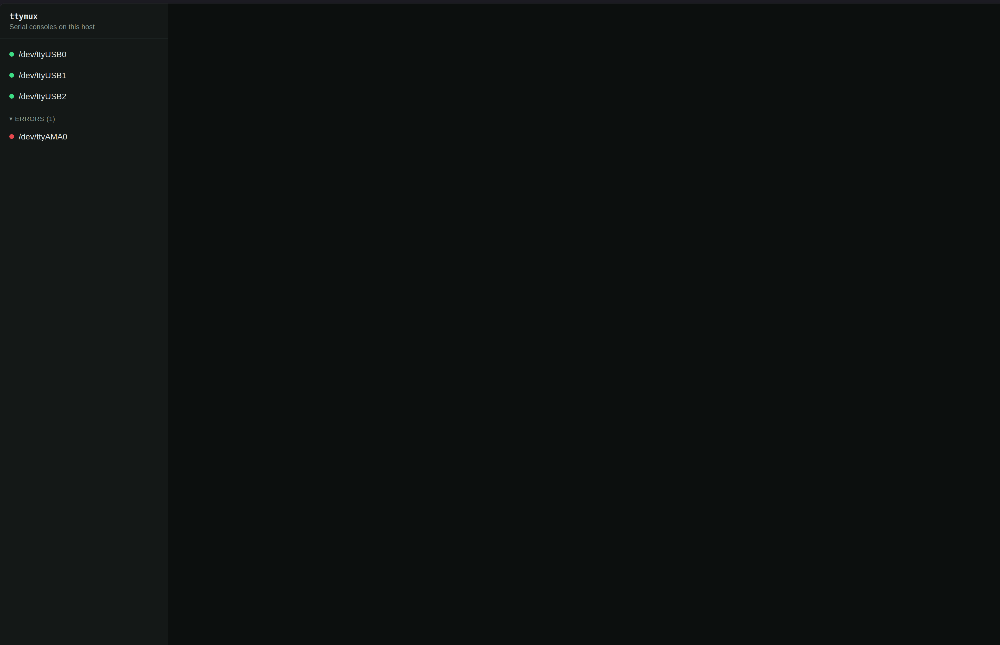

# ttymux

A web dashboard for managing serial-console connections from a single browser.
Point it at a host with USB serial devices attached and it auto-discovers
every port, giving anyone on the team a live terminal in the browser instead
of SSHing in to run `screen`/`minicom`/`picocom` by hand.

Built for embedded development, networking gear, IoT, and lab equipment,
where a serial console is still the only way in.


<!-- maintainers: replace docs/screenshot.png with a real screenshot before release -->

## Features

- **Zero-config**: run the binary, it finds every serial port on the host.
  A config file only refines behavior — nothing is required to get started.
- **Stable port identity**: ports are identified by the most stable id the
  platform offers (`/dev/serial/by-id`/`by-path` on Linux, USB serial number
  or location elsewhere), not by a volatile enumeration index like `ttyUSB0`.
- **Live, shared terminals**: xterm.js in the browser, wired to a per-console
  WebSocket. Everyone watching a console sees the same output.
- **One writer at a time**: a write-token changes hands with a click, with a
  visible indicator of who currently has control — no interleaved keystrokes
  from two people typing at once. An optional per-console "free-for-all"
  mode turns that off when you actually want everyone to type.
- **Hotplug aware**: unplug a device and it's marked offline; plug it back in
  and ttymux reconnects automatically with backoff.
- **Disk logging with rotation**, per port, path configurable.
- **Cross-platform**: Linux, macOS, and Windows.

## Quick start

```sh
npx ttymux
```

Then open the URL it prints (`http://127.0.0.1:9000` by default) in your
browser. That's it — no config file needed.

On Linux, your user needs access to the serial devices, typically via the
`dialout` group:

```sh
sudo usermod -aG dialout $USER
# log out and back in for group membership to take effect
```

### Docker

```sh
docker build -t ttymux .
docker run --device=/dev/ttyUSB0 -p 9000:9000 ttymux
```

Docker needs explicit access to each serial device via `--device`, or
broader access via `--device-cgroup-rule` / mounting `/dev` for dynamically
appearing devices. See [docs/config-reference.md](docs/config-reference.md)
for details.

## Supported platforms

Linux, macOS, and Windows — anywhere Node.js and the [`serialport`](https://serialport.io/)
library run. Stable port identity falls back gracefully on platforms/devices
without a strong USB identifier (you'll see `stableId: false` and an id
derived from the current OS path instead).

## Security

By default ttymux binds to `127.0.0.1` with no authentication — safe because
nothing outside the host can reach it. **If you expose it to a network**
(set `server.host` to `0.0.0.0` or anything non-loopback), turn on
authentication first:

```yaml
auth:
  mode: token # or: basic
  token: "a long random string"
```

Connections from loopback always bypass auth (even with `mode: token`/`basic`
configured), so local tools and health checks keep working. See
[docs/config-reference.md](docs/config-reference.md) for the full config
schema, including HTTP Basic auth with per-user password hashes.

There is no multi-user account system or RBAC in v1 — a single shared
token/credential set is the ceiling. Anyone who can authenticate can read
and write every console.

## Configuration

Fully optional — see [config.example.yaml](config.example.yaml) for every
key with comments, and [docs/config-reference.md](docs/config-reference.md)
for the full reference. Config lets you set friendly names and groups for
ports, per-port default settings, log location/rotation, and auth.

## Development

```sh
npm install
npm run dev     # backend + frontend, both with live reload
npm run build   # build all packages
npm test        # unit tests (write-token arbitration, reconnect/backoff)
npm run lint
```

See [CONTRIBUTING.md](CONTRIBUTING.md) for the monorepo layout and how to
submit changes.

## License

MIT — see [LICENSE](LICENSE).
